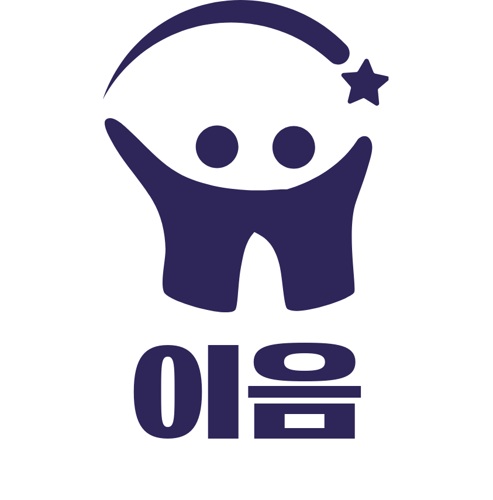
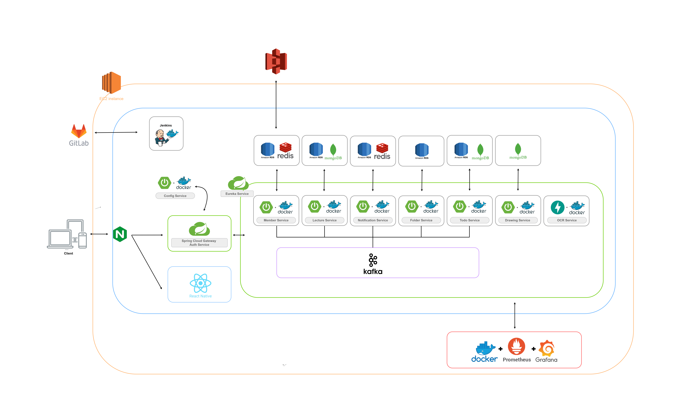
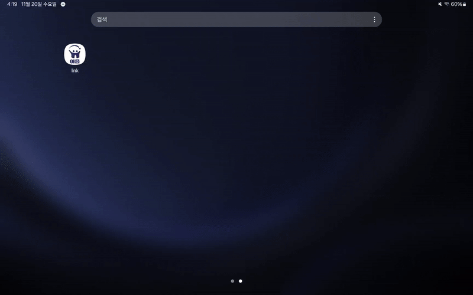
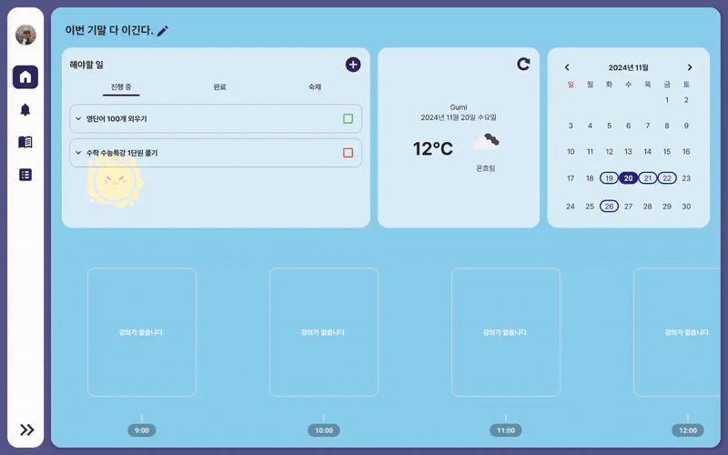

# 이음 

> **선생님과 학생을 잇는 지식의 다리**

# 프로젝트 소개

💁‍♂️ 학습과 교육의 과정에서 이런 고민을 해본 적이 있나요?  
💁‍♂️ 문제집이나 PDF 파일을 수업에 활용하고 싶지만, 문제를 정리하고 분할하는 작업이 번거로우셨나요?  
💁‍♂️ 실시간으로 선생님과 화면을 공유하며 생생한 소통을 원하지만 방법을 찾기 힘드셨나요?  
💁‍♂️ 수업의 진행 상황을 한눈에 볼 수 있는 대시보드가 필요하셨나요?  
💁‍♂️ 문제들을 따로 관리하고 싶지만 마땅한 툴이 없어 불편하셨나요?  
💁‍♂️ 수업에서 그림이나 필기가 꼭 필요한데, 기존 도구들이 불편했던 경험이 있으신가요?

이 모든 고민을 해결할 새로운 교육 플랫폼, ***이음***을 소개합니다! 🌟

***이음***은 
> 선생님과 학생의 학습을 더욱 효율적이게 연결하는 교육 지원 서비스입니다.

1️⃣ **PDF 문제 등록 및 자동 분할**  
⇒ PDF 문제를 손쉽게 업로드하고, 필요한 부분만 자동으로 분할하여 바로 활용할 수 있습니다.

2️⃣ **실시간 화면 공유**  
⇒ 선생님과 학생이 한 화면에서 소통하며 생생한 학습 경험을 만들어냅니다.

3️⃣ **대시보드 제공**  
⇒ 수업 별로 학습 상황을 한눈에 확인할 수 있는 맞춤형 대시보드를 제공합니다.

4️⃣ **숙제 관리 및 문제 보관함**  
⇒ 개인이 필요한 문제들을 간편하게 관리할 수 있습니다. 

5️⃣ **Canvas 기반의 Drawing 필기 기능**  
⇒ Drawing 기능을 제공하여 수업과 학습에서 편리함을 더해줍니다.

이음은 선생님과 학생 간의 소통을 강화하고, 학습 환경을 보다 효율적으로 개선하기 위해 개발되었습니다.
지식의 다리를 만들어가는 이음과 함께, 새로운 학습의 세계를 경험해보세요!

 

# 기술 스택

### Frontend

 
 
 
 
 

### Backend

 

### DevOps

 
 
 
 
 
  

### Monitoring

 

# 시스템 아키텍처
  

# 기능

회원 기능

### 회원가입(선생님)

### 자동 로그인

### 프로필 관리

 

메인 페이지

### 한줄 메시지

### Todo 생성

### Todo 관리

### 날씨 및 달력

### 시간표

### 사이드 바

 

수업

### 공지사항 설정

### 수업 리스트

### 숙제 내기

### 시험 생성

### 시험, 숙제 결과 확인

### 학급평균 및 개별 점수 확인

### 수업 필기 다시보기

### 수업 시작

### 학생 입장

### 문제 풀기(숙제 페이지)

### 시험 제출(시험 페이지)

 

알림 서비스

### 알림 서비스

### D-day

### 알림 관리(읽음, 삭제)

 

문제 서비스(OCR)

### OCR

### 문제 미리보기

### 폴더(문제 보관함)

 

# 팀원 소개

### 💻 Frontend

| 박효진(팀장) | 김동준 | 손민락 |
|:---------:|:---------:|:---------:|
| [   @piaoria](https://github.com/piaoria) | [   @kdj4355](https://github.com/kdj4355) | [   @pushedRak](https://github.com/pushedRak) |

### 🗃️ Backend
|이예찬 | 이지언 | 정진규
|:--------:|:---------:|:---------:|
| [   @yechanissm](https://github.com/yechanissm) | [   @Leejieon](https://github.com/Leejieon) | [   @kkyu99](https://github.com/kkyu99) |
